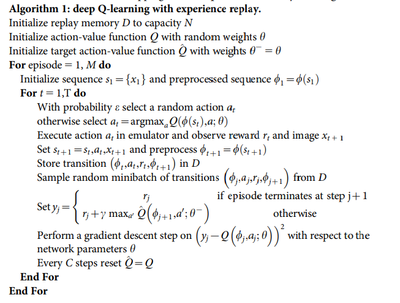

# DRL-Navigation

[//]: # (Image References)

[image1]: https://user-images.githubusercontent.com/10624937/42135619-d90f2f28-7d12-11e8-8823-82b970a54d7e.gif "Trained Agent"

# Project 1: Navigation

### Algorithm

For this project I implemented the Deep Q-Network as described in the paper: [Human-level control through deep reinforcement
learning](https://storage.googleapis.com/deepmind-media/dqn/DQNNaturePaper.pdf)

This approach moves beyond standard online Q-Learning in two respects:
* Experience replay
* Use a separate network for generating the targets in the Q-learning update

Both of these improvements help to address instabilities associated with Q-Learning.  The paper describes it as follows:

> We address these instabilities with a novel variant of Q-learning, which
> uses two key ideas. First, we used a biologically inspired mechanism
> termed experience replay that randomizes over the data, thereby
> removing correlations in the observation sequence and smoothing over
> changes in the data distribution. Second, we used
> an iterative update that adjusts the action-values (Q) towards target
> values that are only periodically updated, thereby reducing correlations
> with the target.

The pseudo-code from the paper is as follows:

### Implementation

The code used for this project is heavily based on the solution in the Deep Q-Learning Lunar Lander project.

The report clearly describes the learning algorithm, along with the chosen hyperparameters. It also describes the model architectures for any neural networks.

Plot of Rewards

Ideas for Future Work
